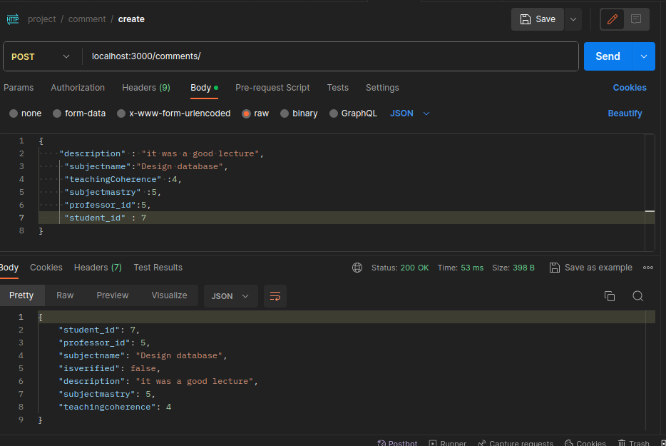

# Database project

<H4> this project has educational propose for designing database and implementing that in PostgreSQL .
 it didn't matter what language or architecture to use . just to test the database design
</H4> 

 ### entity relation diagram
 

 ### logical diagram
 

# How to run it :
    1.make sure you have installed node.js and PostgreSQL

    2.run sql queries in query.sql in order.
    
    3. in db.js change configs to connect to PostgreSQL server

    3.run  "node ./src/index.js "

# [postman workspace](https://www.postman.com/winter-astronaut-108393/workspace/databaseproject/collection/17431671-a4defd69-9cd1-4f5e-b6b6-ecc5a1d90e39?action=share&creator=17431671)
   
# students  

 ### create student 

 ### update student name

 ### get all students

 ### delete student

# professor

 ### create professor 

 ###  update professor

 ###  verify professor

###  get all  professor

###  delete professor

# subject 

###  create subject

###  update subject name

###  verify subject

###  delete subject

###  get professor subject

# comment

###  create comment

###  get professor commment

###  verify comment

###  delete comment

